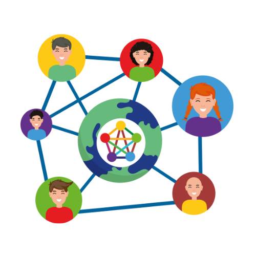
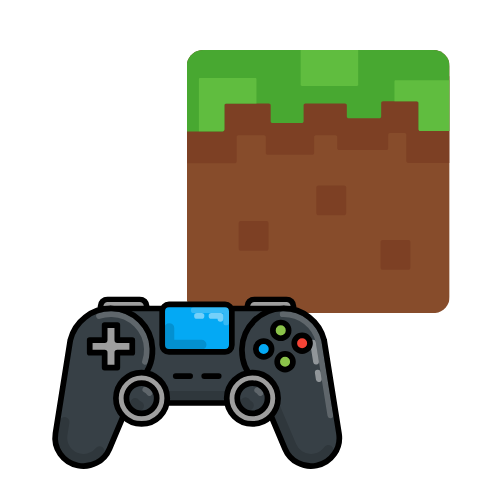

import { Steps } from '@astrojs/starlight/components';

Java es un lenguaje de programación que permite crear programas que pueden funcionar en casi cualquier computadora o dispositivo. Es conocido por su lema: **"Escribe una vez, ejecuta en cualquier lugar"**, lo que significa que un programa hecho en Java se puede usar en diferentes sistemas operativos como Windows, macOS o Linux sin cambios.

Además, Java no solo se usa para computadoras; ¡también está presente en teléfonos Android, servidores web y hasta en cajeros automáticos!

## Un vistazo a la historia de Java

- **Nace en 1991**: Un equipo de ingenieros de Sun Microsystems, liderado por **James Gosling**, creó Java como parte de un proyecto llamado *Green*. Inicialmente, se pensaba para dispositivos electrónicos como televisores.
  
- **Primer lanzamiento (1995)**: Java 1.0 llegó al público con su característica de portabilidad, revolucionando el mundo de la programación.

- **Oracle y Java**: En 2009, la empresa **Oracle Corporation** compró Sun Microsystems y tomó el control de Java, manteniéndolo hasta el día de hoy.

import { Card, CardGrid } from '@astrojs/starlight/components';

<CardGrid>
	<Card title="James Gosling">
		
        
James Gosling, conocido como el "padre de Java", lideró el equipo que creó este lenguaje de programación revolucionario.

	</Card>
	<Card title="Java a Oracle">
		
        
En 2009, Oracle adquirió Sun Microsystems y se convirtió en el propietario de Java, manteniendo su desarrollo y soporte.

	</Card>
</CardGrid>

## Las características que hacen único a Java

Java es un lenguaje de programación poderoso y versátil. Aquí te presentamos algunas de sus características más importantes:

<CardGrid>
	<Card title="Multiplataforma" icon='laptop'>
		Un programa en Java puede ejecutarse en cualquier sistema operativo gracias a la **Máquina Virtual de Java (JVM)**.
	</Card>
	<Card title="Fácil de aprender" icon='open-book'>
		Su sintaxis (cómo se escribe el código) es clara y similar a lenguajes como C y C++, lo que facilita su aprendizaje.
	</Card>
    <Card title="Seguro" icon='seti:lock'>
        Java protege tus programas de amenazas externas y administra automáticamente la memoria.
    </Card>
    <Card title="Orientado a objetos" icon='seti:svg'>
        Java organiza el código en *clases* y *objetos*, lo que ayuda a que sea más claro y fácil de mantener.
    </Card>
    <Card title="Multitarea" icon='list-format'>
        Java permite ejecutar varias tareas al mismo tiempo, ideal para programas que necesitan ser rápidos.
    </Card>
    <Card title="Bibliotecas listas para usar" icon='seti:notebook'>
        Incluye muchas herramientas que simplifican tareas comunes, como conectarse a bases de datos o crear interfaces gráficas.
    </Card>
</CardGrid>

## Tecnologías que usan Java

Java es un lenguaje versátil que se utiliza en una amplia variedad de tecnologías y aplicaciones que puedes ver en Puedes [aquí](https://www.oracle.com/pe/java/technologies/). Algunas de las áreas donde Java brilla son:

<CardGrid>
	<Card title="Java SE">
		
        
La Edición Estándar de Java es la base para la mayoría de las aplicaciones Java, incluyendo aplicaciones de escritorio y servicios web.

	</Card>

    <Card title="Java EE">
        
        
La Edición Empresarial de Java se enfoca en aplicaciones empresariales complejas, escalables y seguras.

    </Card>

    <Card title="Java ME">
        
        
La Edición Micro de Java está diseñada para dispositivos con recursos limitados, como teléfonos móviles y sistemas integrados.

    </Card>

    <Card title="Java Card">
        
        
Java Card es una plataforma segura para tarjetas inteligentes y dispositivos con microcontroladores.

    </Card>

    <Card title = "Java TV">
        
        
Java TV es una plataforma para aplicaciones interactivas y servicios de televisión digital.

    </Card>

    <Card title="Java DB">
        
        
Java DB es una base de datos relacional basada en Apache Derby que se puede integrar fácilmente en aplicaciones Java.

    </Card>

</CardGrid>

## ¿Dónde se usa Java?

Java es un lenguaje de programación muy popular y se utiliza en una amplia variedad de aplicaciones y tecnologías. Algunas de las áreas donde Java es esencial son:

<CardGrid>
	<Card title="Sitios Web">
		
        
Java es ampliamente utilizado en el desarrollo de aplicaciones web, especialmente en aplicaciones empresariales y de comercio electrónico.

	</Card>

    <Card title="Internet de las cosas (IoT)">
        
        
Java se utiliza en dispositivos inteligentes, como termostatos y relojes inteligentes, para impulsar la conectividad y la interactividad.

    </Card>

    <Card title="Aplicaciones Empresariales">
        
        
Java es el lenguaje de programación preferido para el desarrollo de aplicaciones empresariales, como sistemas de gestión de recursos empresariales (ERP) y sistemas de planificación de recursos empresariales (ERP).

    </Card>

    <Card title="Juegos">
        
        
Aunque no es el lenguaje de programación más popular para el desarrollo de juegos, Java se utiliza en el desarrollo de juegos simples y aplicaciones interactivas.

    </Card>

    <Card title = "Finanzas">
        
        
Java es ampliamente utilizado en el sector financiero para el desarrollo de sistemas seguros y fiables.

    </Card>

    <Card title="Aplicaciones Móviles">
        
        
Java es el lenguaje de programación principal para el desarrollo de aplicaciones Android.

    </Card>

    

</CardGrid>

## Conclusión

Java es un lenguaje de programación versátil y poderoso que se utiliza en una amplia variedad de aplicaciones y tecnologías. Su portabilidad, seguridad y facilidad de uso lo convierten en una excelente opción para desarrolladores de todo el mundo. Si estás interesado en aprender Java, ¡sigue adelante! ¡Te espera un mundo de posibilidades!

