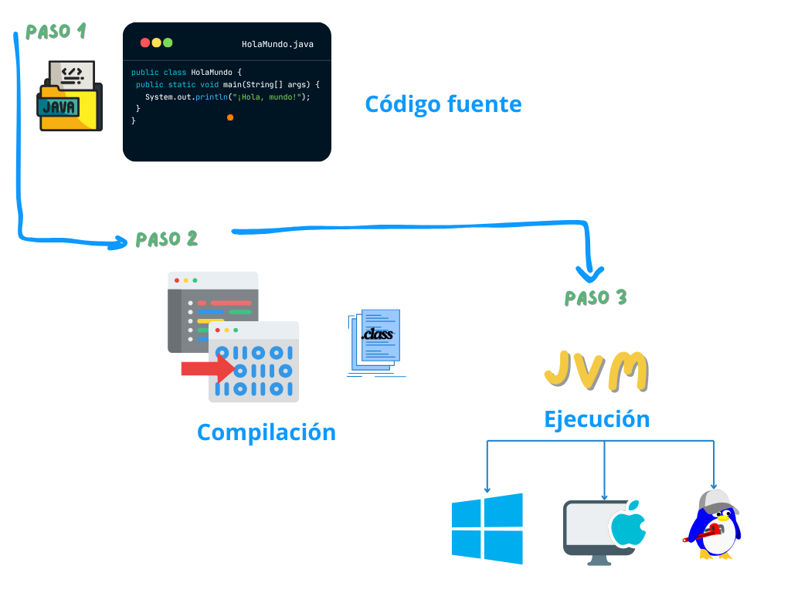

import { Steps } from '@astrojs/starlight/components';

Java es uno de los lenguajes de programación más populares debido a su capacidad de ser "escriba una vez, ejecute en cualquier lugar". Esto significa que, con Java, puedes crear un programa que funcione en diferentes plataformas (Windows, macOS, Linux, etc.) sin necesidad de cambiar el código. Pero, ¿cómo es posible? Todo gracias a la **Máquina Virtual de Java (JVM)** y al proceso de compilación y ejecución.


## Compilación y ejecución de código Java

El proceso de crear y ejecutar un programa en Java tiene tres pasos principales:

<Steps>

1. **Creación de un código fuente en Java:** 
    Todo comienza escribiendo el código fuente en un archivo con extensión **`.java`**. Este código contiene las instrucciones que queremos que nuestra computadora ejecute. Por ejemplo:

    ```java
    public class HolaMundo {
        public static void main(String[] args) {
            System.out.println("¡Hola, mundo!");
        }
    }
    ```

    Este archivo puede ser escrito en cualquier editor de texto, aunque normalmente usamos entornos de desarrollo como **IntelliJ IDEA**, **Eclipse** o **Visual Studio Code** para hacerlo más fácil.

2. **Compilación del código fuente en bytecode:** 
    Después de escribir el código, debemos compilarlo. La compilación es el proceso de convertir el código que escribimos en un formato que la computadora pueda entender: el **bytecode**.

    El compilador de Java, llamado **`javac`**, toma nuestro archivo **`.java`** y lo transforma en un archivo con extensión **`.class`**. Por ejemplo:

    ```bash
    javac HolaMundo.java
    ```

    Esto genera un archivo llamado **`HolaMundo.class`** que contiene el bytecode, un conjunto de instrucciones que no están vinculadas a ningún sistema operativo específico.

3. **Ejecución del bytecode en la Máquina Virtual de Java (JVM)**
    El bytecode por sí solo no puede ejecutarse directamente en la computadora. Necesitamos una "traductora", que es la **Máquina Virtual de Java (JVM)**.

    Cuando ejecutamos el programa usando el comando:

    ```bash
    java HolaMundo
    ```

    La JVM interpreta el bytecode contenido en **`HolaMundo.class`** y lo traduce en instrucciones específicas para el sistema operativo donde se está ejecutando. Finalmente, el programa muestra el resultado:

    ```
    ¡Hola, mundo!
    ```

</Steps>



## Máquina Virtual de Java (JVM)

La **JVM** es el núcleo de cómo funciona Java. Es responsable de:

1. **Interpretar el bytecode**: Traduce las instrucciones del bytecode a un lenguaje que el sistema operativo pueda entender.
2. **Gestión de memoria**: Ayuda a organizar y liberar la memoria que usa tu programa mientras se ejecuta.
3. **Portabilidad**: Como el bytecode es independiente de la plataforma, la JVM asegura que el mismo código puede ejecutarse en cualquier sistema operativo que tenga una JVM instalada.

Cada sistema operativo tiene su propia versión de JVM, lo que hace que Java sea tan flexible.

---

## Conclusión

En pocas palabras, así funciona Java:
1. Escribes tu código fuente en un archivo **`.java`**.
2. Compilas el código con **`javac`**, generando un archivo **`.class`** con bytecode.
3. Ejecutas el programa con **`java`**, y la JVM se encarga de interpretar el bytecode para tu sistema operativo.

Gracias a este proceso, Java es un lenguaje poderoso, portable y muy utilizado tanto para aplicaciones web como para software de escritorio y móvil. ¡Intenta escribir tu primer programa y experimenta cómo funciona!