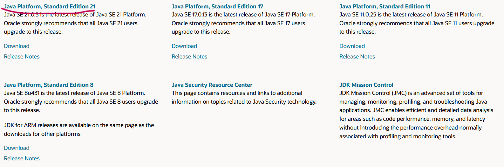
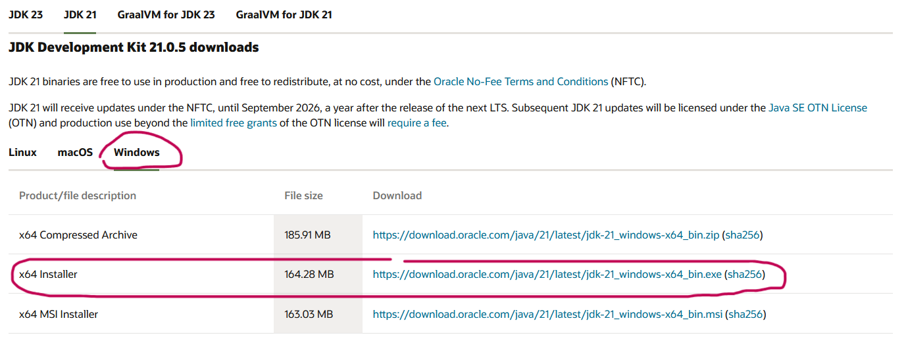
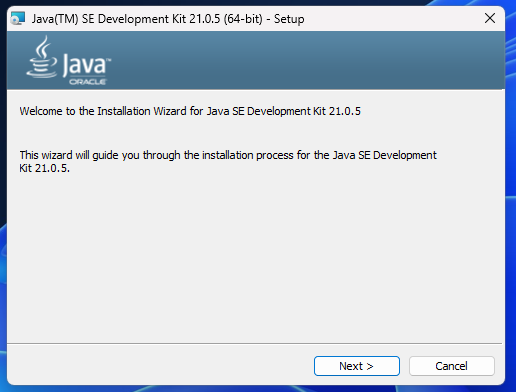
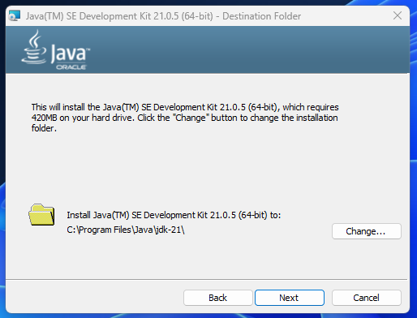
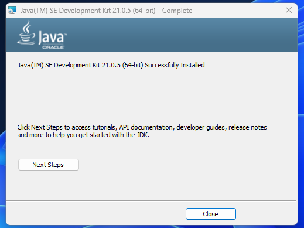

import { Tabs, TabItem, Steps } from "@astrojs/starlight/components";

Te guiaré de forma sencilla para descargar e instalar el JDK (Java Development Kit) directamente desde el sitio oficial de Oracle, una fuente confiable y ampliamente utilizada para obtener la versión más reciente de Java para tus proyectos de desarrollo. A continuación, te explico el proceso paso a paso de manera clara y detallada.

<Tabs>

  <TabItem label="Windows" icon="seti:windows">
  ## Guía para Instalar JDK
<Steps>

    1. Ir al sitio web de Java SE

        Abre tu navegador web y accede al sitio oficial de [Java SE](https://www.oracle.com/pe/java/technologies/java-se-glance.html). Aquí podrás ver las versiones disponibles del JDK. Para este tutorial, trabajaremos con la versión **JDK 21**.

        

    2. Descargar JDK 21

        En la lista de descargas, selecciona la versión correspondiente a **Windows**. Puedes optar por el instalador en formato `.exe` (recomendado) o `.msi` según tu preferencia.

        

    3. Instalar JDK

        Sigue estos pasos para instalar correctamente el JDK:

        - **Ejecuta el instalador** que descargaste previamente.
        

        En la ventana de instalación, haz clic en el botón **`Next`** para comenzar.

        

        Selecciona la **ruta de instalación** deseada o deja la predeterminada. Luego, haz clic en **`Next`**.

        

        Una vez finalizada la instalación, haz clic en **`Close`** para cerrar el instalador.

        
</Steps>
  </TabItem>

  <TabItem label="Linux" icon="linux">
  1. **Extraer el archivo comprimido**:  
   Si descargaste un archivo `.tar.gz`, abre una terminal y usa el siguiente comando para descomprimir el archivo:
   ```bash
   tar -xvzf <nombre-del-archivo>.tar.gz
   ```

2. **Mover el JDK a una ubicación conveniente**:  
   Mueve la carpeta descomprimida a un directorio como `/opt/java/` para facilitar su acceso.

3. **Configurar las variables de entorno**:  
   Abre el archivo de configuración de tu terminal (por ejemplo, `.bashrc` o `.zshrc`) y agrega las siguientes líneas:

   ```bash
   export JAVA_HOME=/opt/java/<nombre-del-jdk>
   export PATH=$JAVA_HOME/bin:$PATH
   ```

4. **Aplicar los cambios**:  
    Ejecuta `source ~/.bashrc` o `source ~/.zshrc` para aplicar las configuraciones.
</TabItem>

  <TabItem label="macOS" icon="apple">
  1. **Abrir el archivo descargado**:  
   Abre el archivo `.pkg` descargado. El instalador se abrirá automáticamente.

2. **Seguir las instrucciones del instalador**:  
   Haz clic en **Continuar** y luego en **Instalar** para iniciar la instalación. Se instalará en la ubicación predeterminada.

3. **Finalizar la instalación**:  
    Al finalizar, el instalador te notificará que la instalación se completó con éxito.
</TabItem>
</Tabs>

## Verificar la instalación

Una vez que hayas instalado el JDK, es importante verificar que se haya instalado correctamente.

1. **Abrir la terminal** (o CMD en Windows).
2. Escribe el siguiente comando y presiona Enter:
   ```bash
   java ---version
   ```
   Si todo está correcto, deberías ver la versión de Java que acabas de instalar.
