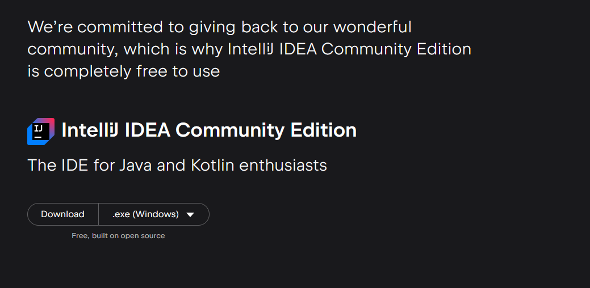
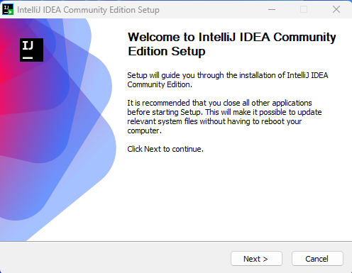
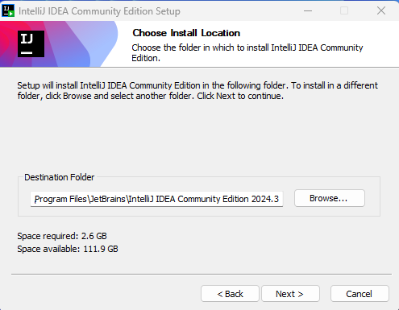
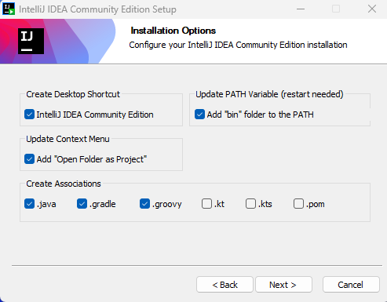
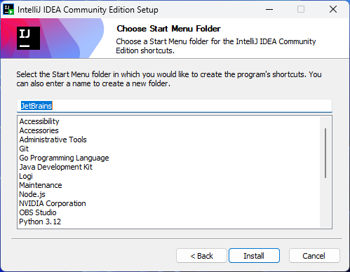
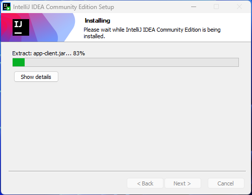
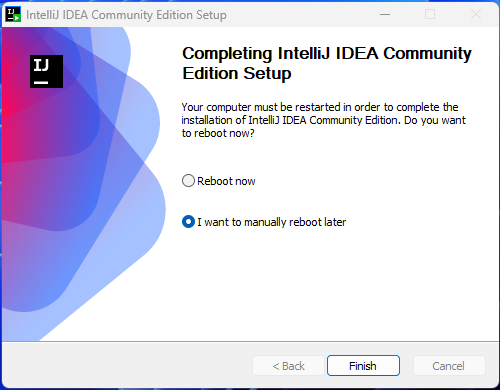

import { Tabs, TabItem, Steps } from "@astrojs/starlight/components";

**IntelliJ IDEA Community Edition** es un entorno de desarrollo integrado (IDE) gratuito y de código abierto, ideal para trabajar con Java, Kotlin y otros lenguajes. En este artículo, aprenderás a instalarlo y configurarlo paso a paso en tu sistema operativo.

## Guía para Instalar IntelliJ

<Tabs>
  <TabItem label="Windows" icon="seti:windows">
    <Steps>
      1. **Descargar IntelliJ IDEA Community Edition**  
         Abre tu navegador web y visita el sitio oficial de JetBrains:  
         [Descargar IntelliJ IDEA Community Edition](https://www.jetbrains.com/idea/download/).  

         En la página de descargas, selecciona la pestaña **Community** (gratuita).  
         Haz clic en el botón de descarga correspondiente a tu sistema operativo (en este caso, Windows).  
         

      2. **Instalar IntelliJ IDEA Community Edition**  
         Después de descargar el instalador, sigue estos pasos para la instalación:  
         - **Ejecuta el instalador** haciendo doble clic en el archivo descargado.  
         

         - En la ventana de bienvenida, haz clic en **`Next`** para continuar.  
         

         - Selecciona la **carpeta de instalación**. Puedes dejar la ubicación predeterminada o elegir una carpeta personalizada. Luego, haz clic en **`Next`**.  
         

         - Marca las siguientes opciones de configuración adicionales según tus necesidades:  
           - **Create desktop shortcut:** Crear acceso directo en el escritorio.  
           - **Update context menu:** Añadir "Abrir carpeta como proyecto" al menú contextual.  
           - **Update PATH variable:** Añadir la carpeta `bin` al `PATH` del sistema (necesitarás reiniciar).  
           - **Create associations:** Asociar archivos `.java`, `.gradle` y `.groovy` a IntelliJ IDEA.  

            

         - Presiona **install** para continuar.
         

         - Inicia la instalación.
         

         - Finaliza la instalación presionando **Finish**.
         

      3. **Configuración Inicial de IntelliJ IDEA Community Edition**  
         - **Importar configuración:** Si no tienes configuraciones anteriores, selecciona **"Do not import settings"**.  
         - **Elegir tema:** Elige entre **Light** o **Dark** según tu preferencia.  
         - **Instalar plugins recomendados:** Puedes añadir extensiones para personalizar tu experiencia.

      4. **Crear tu Primer Proyecto en IntelliJ IDEA Community Edition**  
         - Haz clic en **`New Project`** desde la pantalla principal.  
         - Selecciona el SDK (Java Development Kit) que deseas utilizar. Asegúrate de haber instalado previamente el JDK (por ejemplo, **JDK 21**).  
         - Configura el nombre y la ubicación del proyecto.  
         - Haz clic en **`Create`** para comenzar a desarrollar tu aplicación.  
    </Steps>
  </TabItem>

  <TabItem label="Linux" icon="linux">
    <Steps>
      1. **Extraer el archivo comprimido:**  
         Si descargaste un archivo `.tar.gz`, abre una terminal y usa el siguiente comando para descomprimir el archivo:  
         ```bash
         tar -xvzf <nombre-del-archivo>.tar.gz
         ```
    </Steps>
  </TabItem>

  <TabItem label="macOS" icon="apple">
    <Steps>
      1. **Abrir el archivo descargado:**  
         Abre el archivo `.pkg` descargado. El instalador se abrirá automáticamente.

      2. **Seguir las instrucciones del instalador:**  
         Haz clic en **Continuar** y luego en **Instalar** para iniciar la instalación. Se instalará en la ubicación predeterminada.
    </Steps>
  </TabItem>
</Tabs>
