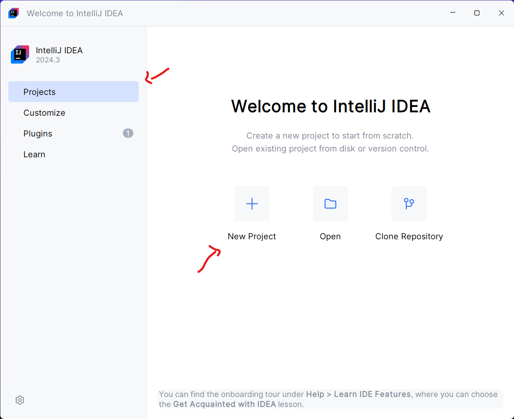
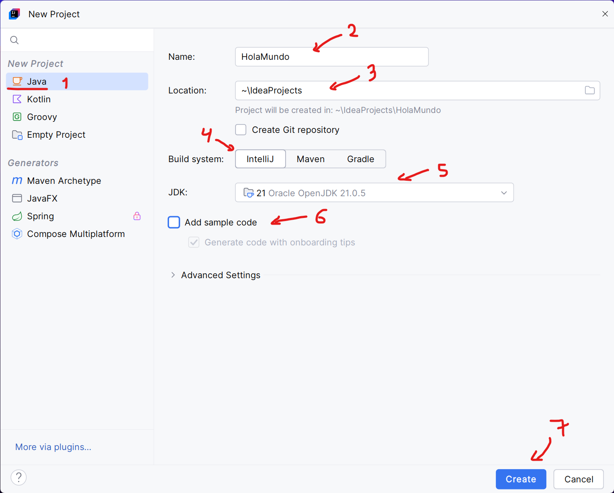
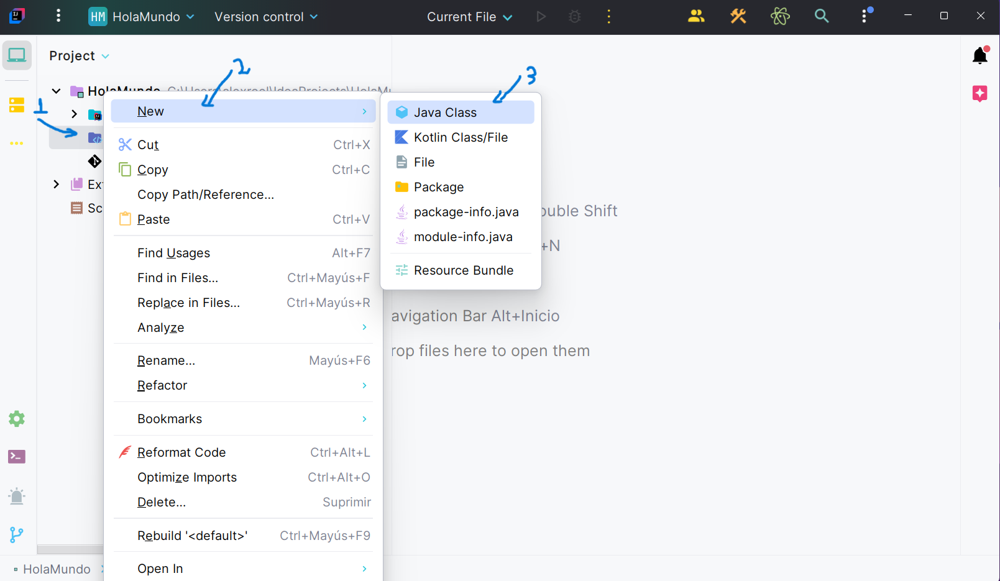
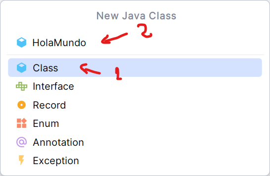
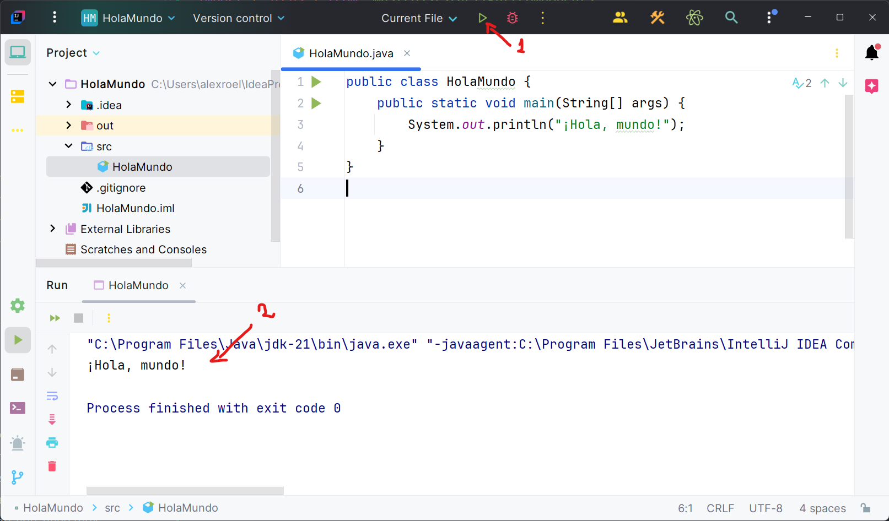

import { Steps, FileTree } from '@astrojs/starlight/components';


## Escribir un programa en Java

Para escribir un programa en Java, necesitas un editor de texto o un entorno de desarrollo integrado (IDE) como **IntelliJ IDEA**, **Eclipse** o **Visual Studio Code**. En este tutorial, usaremos IntelliJ IDEA, pero puedes usar el que prefieras.

<Steps>
1. Abre IntelliJ IDEA y crea un nuevo proyecto haciendo clic en **`Project`** y **``New Project`**. Si ya usaste antes IntelliJ IDEA tambine puedes creap proyecto desde **`File > New > Project`**.

    

2. Selecciona **`Java`** en la lista de opciones, en el campo **`Name`** escribe el nombre del proyecto, por ejemplo **`HolaMundo`**, en le campo **`Location`** selecciona la carpeta donde se guardará el proyecto o dejar la opción por defecto, en la sección **`Build System`** selecciona **`IntelliJ`** ya que es un proyecto simpple, en la parte de **`JDK`** selecciona la versión de Java que tienes instalada en tu computadora y tambine desactiva **`Add sambre code`** para crear nuestro código desde cero y haz clic en **`Create`**.

    

3. En el panel izquierdo, haz clic con el botón derecho en la carpeta **`src`** y selecciona **`New > Java Class`** para crear una nueva clase Java.

    

4. Escribe **`HolaMundo`** en el campo **`Name`** y presiona **`Enter`**.

    

5. Escribe el siguiente código en el archivo **`HolaMundo.java`** o en este caso en IntelliJ IDEA **`HolaMundo`**:

    <FileTree>
    - HolaMundo/
        - .idea/
        - src/
            - **HolaMundo.java**
        - .gitignore
        - HolaMundo.iml
    - External-Libraries/
        - JDK-21

    </FileTree>

    ```java
    public class HolaMundo {
        public static void main(String[] args) {
            System.out.println("¡Hola, mundo!");
        }
    }
    ```

6. Guarda el archivo haciendo clic en **`File > Save`** o presionando **`Ctrl + S`**.
7. Para ejecutar el programa, haz clic en el icono de **`Run`** en la esquina superior derecha de la ventana o presiona **`Shift + F10`**.

    

</Steps>

¡Felicidades! Has escrito tu primer programa en Java. Ahora, puedes ver el resultado en la consola de IntelliJ IDEA.

## Estrucutra de un programa en IntelliJ IDEA

Un programa en Java está compuesto por varias partes, incluyendo:
<FileTree>
    - HolaMundo/
        - .idea/
        - .out/
        - src/
            - HolaMundo.java
        - .gitignore
        - HolaMundo.iml
    - External-Libraries/
        - JDK-21

</FileTree>

1. **`HolaMundo`**: Es el nombre de la clase principal del programa. En Java, cada programa debe tener al menos una clase con un método **`main`**.
2. **`.idea/`**: Carpeta que contiene la configuración del proyecto en IntelliJ IDEA.ç
3. **`.out/`**: Carpeta que contiene los archivos de salida del proyecto.
4. **`src/`**: Carpeta que contiene los archivos fuente del programa.
5. **`HolaMundo.java`**: Archivo que contiene el código fuente del programa.
6. **`.gitignore`**: Archivo que contiene las rutas de los archivos que no se deben incluir en el control de versiones.
7. **`HolaMundo.iml`**: Archivo de configuración del proyecto en IntelliJ IDEA.
8. **`External-Libraries/`**: Carpeta que contiene las librerías externas del proyecto.

## Estrucutra de un programa en Java

Un programa en Java tiene una estructura específica que debes seguir para que funcione correctamente. La estructura básica de un programa en Java es la siguiente:

```java
public class HolaMundo {
    public static void main(String[] args) {
        System.out.println("¡Hola, mundo!");
    }
}
```

- **`public class HolaMundo`**: Define una clase llamada **`HolaMundo`**. En Java, cada programa debe tener al menos una clase con el mismo nombre que el archivo.
- **`public static void main(String[] args)`**: Define un método llamado **`main`** que es el punto de entrada del programa. En Java, el método **`main`** debe tener esta firma para que la JVM pueda ejecutar el programa.
- **`System.out.println("¡Hola, mundo!");`**: Imprime el mensaje **`¡Hola, mundo!`** en la consola. La clase **`System`** proporciona un objeto **`out`** que representa la consola, y el método **`println`** imprime el mensaje en la consola.


## Conclusión

En este tutorial, aprendiste a escribir tu primer programa en Java utilizando IntelliJ IDEA. Ahora, puedes crear programas más complejos y aprender más sobre el lenguaje Java. ¡Sigue adelante! 🚀
