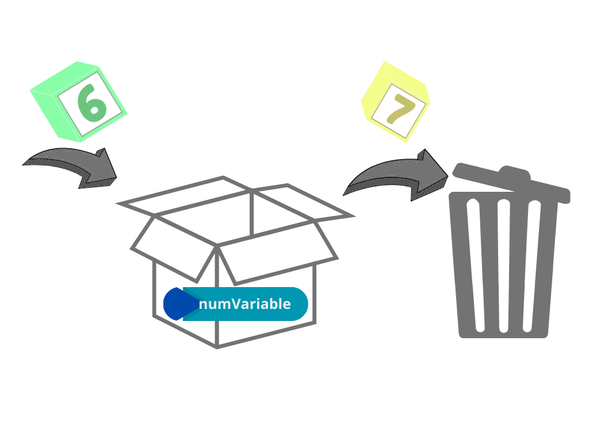

Las variables son elementos fundamentales en la programación que permiten almacenar y gestionar información en un programa. Puedes imaginar una variable como un cajón etiquetado donde guardamos un objeto. Este objeto puede cambiar según las necesidades del programa, lo que hace que las variables sean dinámicas y útiles.

Las variables nos ayudan a trabajar con diferentes tipos de información, como números, texto o valores lógicos. Son esenciales para que los programas realicen tareas como cálculos, organización de datos y toma de decisiones.

## ¿Cómo funcionan las variables?

El funcionamiento de las variables puede entenderse pensando en cómo usamos cajones en un escritorio. Cada cajón tiene una etiqueta (nombre de la variable) y contiene algo específico (el valor). Cuando necesitamos usar el contenido, simplemente abrimos el cajón usando su etiqueta.

Por ejemplo:  
- Declarar una variable es como preparar un cajón vacío y etiquetarlo. Asignar un valor es como colocar un objeto dentro del cajón.

- Usar la variable es como abrir el cajón y sacar el objeto.

Las variables son contenedores en los que se alamacenan valores que pueden ser utilizados y modificados a lo largo de un programa. 

## Nomenclaturas de Variables

**La nomenclatura de variables** es un conjunto de reglas y buenas prácticas que definen cómo se deben nombrar las variables en un programa para garantizar que el código sea claro, consistente y fácil de entender. Una nomenclatura adecuada mejora la legibilidad, facilita el mantenimiento y ayuda a los desarrolladores a comprender rápidamente la funcionalidad del código.

### Principios básicos de una buena nomenclatura

1. **Descriptiva**:  
   El nombre de la variable debe describir su propósito o contenido.  
   - Malo: `x`, `y`, `var1`.  
   - Bueno: `totalVentas`, `precioUnitario`.

2. **Consistente**:  
   Debe seguir un estándar uniforme en todo el proyecto, como *camelCase* o *snake_case*.  
   - camelCase: `cantidadProductos`.  
   - snake_case: `cantidad_productos`.

3. **Legible**:  
   Evitar abreviaturas innecesarias o nombres crípticos.  
   - Malo: `cntPrd`.  
   - Bueno: `cantidadProductos`.

4. **Evitar palabras reservadas o genéricas**:  
   Usar nombres significativos y específicos.  
   - Malo: `data`, `temp`.  
   - Bueno: `datosClientes`, `archivoTemporal`.

### Estándares comunes de nomenclatura

1. **Camel Case** (mayúscula en cada palabra, excepto la primera):  
   - Usado comúnmente en JavaScript, Java, y otros lenguajes.  
   - Ejemplo: `nombreUsuario`, `totalPagar`.

2. **Pascal Case** (mayúscula en todas las palabras):  
   - Usado frecuentemente en nombres de clases o estructuras.  
   - Ejemplo: `NombreUsuario`, `TotalPagar`.

3. **Snake Case** (palabras separadas por guiones bajos):  
   - Común en Python y bases de datos.  
   - Ejemplo: `nombre_usuario`, `total_pagar`.

4. **Kebab Case** (palabras separadas por guiones):  
   - Usado en nombres de archivos o variables CSS.  
   - Ejemplo: `nombre-usuario`, `total-pagar`.

---

### Errores comunes al nombrar variables

- **Nombres demasiado largos o cortos**:  
  - Largo: `estaEsLaVariableQueContieneElTotalDeLasVentas`.  
  - Corto: `t`.  
  - Ideal: `totalVentas`.

- **Usar caracteres especiales**:  
  Evitar caracteres no permitidos como espacios, guiones o símbolos (`#`, `$`).  

- **No usar un idioma consistente**:  
  Mezclar idiomas puede confundir: `precioTotal` y `totalPrice`. Es mejor elegir uno (español o inglés).

